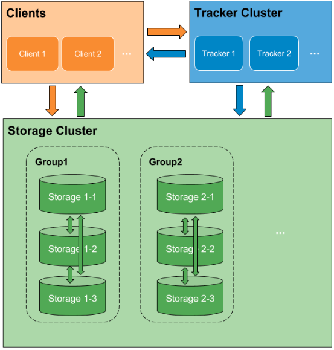
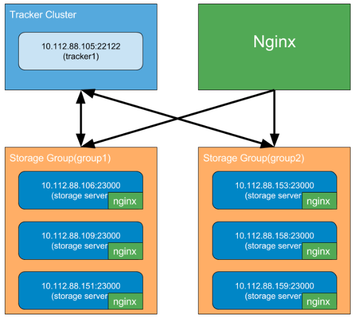
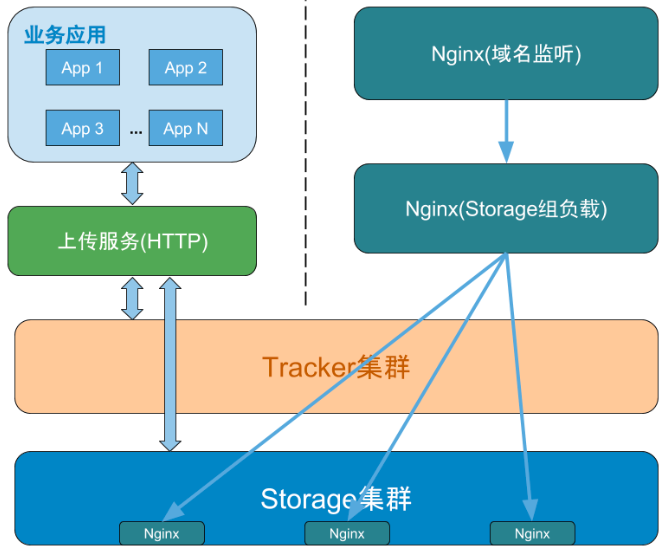

# fastdfs 安装

## 安装环境
| 组件        | 版本   |
|-------------- |-------------|
|操作系统	        |  Centos7.2 Final |
|FastDFS版本	     |  fastdfs-5.11.tar.gz|
|libfastcommon  | 	https://github.com/happyfish100/libfastcommon |
| nginx              |     	nginx-1.14.0.tar.gz |
| fastdfs-nginx-module | 	fastdfs-nginx-module_1.21  |


## 架构
app25---tracker   192.168.77.76  fastdfs，fastcommon，nginx

app26---storage   192.168.77.77  fastdfs，fastcommon，nginx，fastdfs-nginx-module  
app27---storage   192.168.77.78  fastdfs，fastcommon，nginx，fastdfs-nginx-module



## 安装libfastcommon，fastdfs （所有节点）

```
# fastcommon
wget https://github.com/happyfish100/libfastcommon.git 
#安装libfastcommon-master(与libfastcommon不同，里面多了很多头文件)
tar zxvf libfastcommon-master.tar.gz
cd libfastcommon-master/
./make.sh
./make.sh install

# fastdfs安装
wget https://github.com/happyfish100/fastdfs/archive/V5.11.tar.gz
cd fastdfs-5.11/
./make.sh
./make.sh install
```

## tracker配置 （192.168.77.76）

```
mkdir -p /data/fastdfs/
cd /etc/fdfs/
cp tracker.conf.sample tracker.conf
vim tracker.conf
#修改参数
base_path=/data/fastdfs
```
- 创建软链接
```
ln -s /usr/bin/fdfs_trackerd /usr/local/bin/
ln -s /usr/bin/stop.sh /usr/local/bin/
ln -s /usr/bin/restart.sh /usr/local/bin/
```
- 启动服务
`service fdfs_trackerd start` 或者
	/usr/bin/fdfs_trackerd /etc/fdfs/tracker.conf restart	`
- 查看监听
`netstat -nltp|grep fdfs`

## storage配置（192.168.77.77，192.168.77.78）
```
mkdir -p /data/fastdfs/storage
cd /etc/fdfs/
cp storage.conf.sample storage.conf
vim storage.conf
#修改下面参数
# the base path to store data and log files
base_path=/data/fastdfs/storage
# store_path#, based 0, if store_path0 not exists, it's value is base_path
# the paths must be exist
store_path0=/data/fastdfs/storage
#store_path1=/home/yuqing/fastdfs2
# tracker_server can ocur more than once, and tracker_server format is
#  "host:port", host can be hostname or ip address
tracker_server=192.168.77.76:22122
```
- 创建软链接
`ln -s /usr/bin/fdfs_storaged /usr/local/bin/`
- 启动服务
`service fdfs_storaged start` 或者
`/usr/bin/fdfs_storaged /etc/fdfs/storage.conf restart`
- 查看监听
`/usr/bin/fdfs_monitor /etc/fdfs/storage.conf`

## 设置开机启动
```
vim /etc/rc.d/rc.local     
#最后添加  
/etc/init.d/fdfs_storaged start 
```

省略软连接设置自启动
` echo '/usr/bin/fdfs_storaged /etc/fdfs/storage.conf restart' >> /etc/rc.d/rc.local`


## 上传下载
通常，对于图片和文件的访问，是不太可能走TCP，而是通过简单的HTTP访问，这时需要通过一些Web服务器(如nginx，apache)来代理，fastdfs也有了nginx的支持，下面则将通过安装nginx来完成文件访问，之前的开发环境将变为：

此时已经可以上传，下载还需要安装nginx和fastdfs-nginx-module，安装完成后一起测试
### 完整的文件服务器架构图：

## nginx安装

- ###   tracker上只安装nginx
```
# 源码安装
wget http://nginx.org/download/nginx-1.14.0.tar.gz
sudo apt-get install -y  libpcre3 libpcre3-dev zlib1g-dev   openssl libssl-dev   //安装依赖库
yum -y  install pcre-devel opensslopenssl-devel  zlib-devel  //centos7 安装依赖库
cd  nginx-1.14.0/
./configure
make && make install
```
> 主要配置文件：/usr/local/nginx/conf/nginx.conf
 /etc/init.d/下创建了启动脚本nginx（需手动配置）
程序文件放在/usr/local/nginx/sbin/nginx
日志放在了/var/log/nginx中
虚拟主机的目录设置在/var/www/下

  默认启动
`/usr/local/nginx/sbin/nginx`
#### nginx配置
在默认配置文件（/usr/local/nginx/conf/nginx.conf）中80行增加
include /usr/local/nginx/conf.d/*.conf  ;

```
mkdir -p /usr/local/nginx/conf.d
cd /usr/local/nginx/conf.d
vim fastdfs.conf

# group1的Storage集群
upstream group1_cluster {
    server 10.0.0.132;
    server 10.0.0.134;
}
server {
    listen       80;
    server_name  10.0.0.133;

    location /group1 {
        proxy_pass              http://group1_cluster;
        proxy_set_header        X-Real-IP $remote_addr;
        proxy_set_header        X-Forwarded-For $proxy_add_x_forwarded_for;
        proxy_set_header        Host $http_host;
    }
}
```

- ###  storage上安装nginx和fastdfs-nginx-module （192.168.77.77，192.168.77.78）
将fastdfs-nginx-module目录下面的mod_fastdfs.conf拷贝到/etc/fdfs/
将fastdfs-5.11目录下面的http.conf，mime.types拷贝到/etc/fdfs/
```
# 配置fastdfs-nginx-module所需的配置文件mod_fastdfs.conf，http.conf，mime.types

# vim /etc/fdfs/mod_fastdfs.conf

base_path=/data/fastdfs/storage
tracker_server=10.0.0.133:22122
group_name=group1
url_have_group_name = true
store_path_count=1
store_path0=/data/fastdfs/storage

```
源码安装nginx
```
#下载解压安装依赖库同上面nginx安装
./configure --add-module=../fastdfs-nginx-module-master/src/
make  && make install
```

可能的报错
```
/usr/include/fastdfs/fdfs_define.h:15:27: fatal error: common_define.h: No such file or directory
 #include "common_define.h"

#解决方案
cp /usr/include/fastcommon/* /usr/include/
```
nginx最简单配置
```
# 最简配置/usr/local/nginx/conf/nginx.conf
# user  nginx;
worker_processes  1;
events {
    worker_connections  1024;
}
 
http {
    
    server {
        listen       80;
        server_name  localhost;
 
        # group1为该Storage所在的group
        location ~ /group1/M00 { 
            # 该Storage的data目录
            root /mnt/fastdfs/data;
            # 由于fastdfs保存的文件名已经编码，源文件名将丢失，应用可通过在请求url后加oname参数指定源文件名
            if ($arg_oname != ''){
                add_header Content-Disposition "attachment;filename=$arg_oname";
            }
            # 调用nginx-fastdfs-module模块
            ngx_fastdfs_module;
        }
    }
}
```
启动nginx,不报错即成功
`/usr/local/nginx/sbin/nginx`

开机自启动
`echo '/usr/local/nginx/sbin/nginx ' >> /etc/rc.d/rc.local`

## 在tracker上操作集群，上传下载
修改/etc/fdfs/client.conf
```
base_path=/data/fastdfs
tracker_server=10.0.0.133:22122
```
查看集群
```
 /usr/bin/fdfs_monitor /etc/fdfs/client.conf
```
### 文件上传
```
/usr/bin/fdfs_test /etc/fdfs/client.conf upload /root/test/hello.txt


#结果

This is FastDFS client test program v5.11

Copyright (C) 2008, Happy Fish / YuQing

FastDFS may be copied only under the terms of the GNU General
Public License V3, which may be found in the FastDFS source kit.
Please visit the FastDFS Home Page http://www.csource.org/ 
for more detail.

[2018-07-31 07:38:11] DEBUG - base_path=/data/fastdfs, connect_timeout=30, network_timeout=60, tracker_server_count=1, anti_steal_token=0, anti_steal_secret_key length=0, use_connection_pool=0, g_connection_pool_max_idle_time=3600s, use_storage_id=0, storage server id count: 0

tracker_query_storage_store_list_without_group: 
	server 1. group_name=, ip_addr=10.0.0.134, port=23000
	server 2. group_name=, ip_addr=10.0.1.92, port=23000

group_name=group1, ip_addr=10.0.0.134, port=23000
storage_upload_by_filename
group_name=group1, remote_filename=M00/00/00/CgAAhltgEeOAGIdUAAAADBSRxKc586.txt
source ip address: 10.0.0.134
file timestamp=2018-07-31 07:38:11
file size=12
file crc32=345097383
example file url: http://10.0.0.134/group1/M00/00/00/CgAAhltgEeOAGIdUAAAADBSRxKc586.txt
storage_upload_slave_by_filename
group_name=group1, remote_filename=M00/00/00/CgAAhltgEeOAGIdUAAAADBSRxKc586_big.txt
source ip address: 10.0.0.134
file timestamp=2018-07-31 07:38:11
file size=12
file crc32=345097383
example file url: http://10.0.0.134/group1/M00/00/00/CgAAhltgEeOAGIdUAAAADBSRxKc586_big.txt
```

### 文件下载
```
/usr/bin/fdfs_test /etc/fdfs/client.conf download group1 M00/00/00/CgAAhltgEeOAGIdUAAAADBSRxKc586.txt

结果
storage=10.0.0.134:23000
download file success, file size=12, file save to CgAAhltgEeOAGIdUAAAADBSRxKc586.txt
```


配置详解
[FastDFS的配置、部署与API使用解读（6）FastDFS配置详解之Storage配置 - CSDN博客](https://blog.csdn.net/Poechant/article/details/6996047)