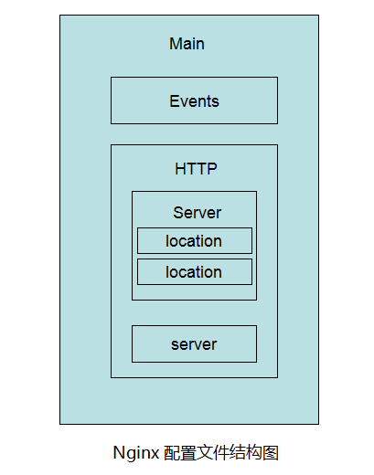

# nginx配置

## nginx 安装

### 1. yum安装
```bash
# 1.将nginx放到yum repro库中
[root@localhost ~]# rpm -ivh http://nginx.org/packages/centos/7/noarch/RPMS/nginx-release-centos-7-0.el7.ngx.noarch.rpm
# 2.查看nginx信息
[root@localhost ~]# yum info nginx
# 3.使用yum安装ngnix
[root@localhost ~]# yum install nginx
# 4.启动nginx
[root@localhost ~]# service nginx start
# 5.查看nginx版本
[root@localhost ~]# nginx -v
# 6.访问nginx，现在你可以通过公网ip (本地可以通过 localhost /或 127.0.0.1 ) 查看nginx 服务返回的信息。
[root@localhost ~]# curl -i localhost

```

### 2. 源码安装
```bash
# 1.下载nginx包。
[root@localhost ~]# wget http://nginx.org/download/nginx-1.14.0.tar.gz
#2.复制包到你的安装目录
[root@localhost ~]# cp nginx-1.14.0.tar.gz /usr/local/
# 3.解压
[root@localhost ~]# tar -zxvf nginx-1.14.0.tar.gz
[root@localhost ~]# cd nginx-1.14.0
./configure
make && make install
# 4.启动nginx
[root@localhost ~]# /usr/local/nginx/sbin/nginx
# 5.查看版本s
[root@localhost ~]# nginx -v
#6.url访问nginx localhost或127.0.0.1
```

### 安装其他模块
在上述第3步

`./configure --add-module=/path/to/module`


后续继续执行即可


### 设置开机启动
在/etc/rc.d/rc.local文件最后一行增加启动的命令
`/usr/local/nginx/sbin/nginx`
`chmod +x /etc/rc.d/rc.local`


## nginx 配置

  
 
yum安装的配置文件路径为
`/etc/nginx/nginx.conf`

源码安装的配置文件路径为
`/usr/local/nginx/conf/nginx.conf`

默认配置文件如下：
```bash
[root@localhost ~]# cat /usr/local/nginx/conf/nginx.conf

#user  nobody;
worker_processes  1;

#error_log  logs/error.log;
#error_log  logs/error.log  notice;
#error_log  logs/error.log  info;

#pid        logs/nginx.pid;


events {
    worker_connections  1024;
}


http {
    include       mime.types;
    default_type  application/octet-stream;

    #log_format  main  '$remote_addr - $remote_user [$time_local] "$request" '
    #                  '$status $body_bytes_sent "$http_referer" '
    #                  '"$http_user_agent" "$http_x_forwarded_for"';

    #access_log  logs/access.log  main;

    sendfile        on;
    #tcp_nopush     on;

    #keepalive_timeout  0;
    keepalive_timeout  65;

    #gzip  on;

    server {
        listen       80;
        server_name  localhost;

        #charset koi8-r;

        #access_log  logs/host.access.log  main;

        location / {
            root   html;
            index  index.html index.htm;
        }

        #error_page  404              /404.html;

        # redirect server error pages to the static page /50x.html
        #
        error_page   500 502 503 504  /50x.html;
        location = /50x.html {
            root   html;
        }

        # proxy the PHP scripts to Apache listening on 127.0.0.1:80
        #
        #location ~ \.php$ {
        #    proxy_pass   http://127.0.0.1;
        #}

        # pass the PHP scripts to FastCGI server listening on 127.0.0.1:9000
        #
        #location ~ \.php$ {
        #    root           html;
        #    fastcgi_pass   127.0.0.1:9000;
        #    fastcgi_index  index.php;
        #    fastcgi_param  SCRIPT_FILENAME  /scripts$fastcgi_script_name;
        #    include        fastcgi_params;
        #}

        # deny access to .htaccess files, if Apache's document root
        # concurs with nginx's one
        #
        #location ~ /\.ht {
        #    deny  all;
        #}
    }

//这里可以配置其他server

    # another virtual host using mix of IP-, name-, and port-based configuration
    #
    #server {
    #    listen       8000;
    #    listen       somename:8080;
    #    server_name  somename  alias  another.alias;

    #    location / {
    #        root   html;
    #        index  index.html index.htm;
    #    }
    #}


    # HTTPS server
    #
    #server {
    #    listen       443 ssl;
    #    server_name  localhost;

    #    ssl_certificate      cert.pem;
    #    ssl_certificate_key  cert.key;

    #    ssl_session_cache    shared:SSL:1m;
    #    ssl_session_timeout  5m;

    #    ssl_ciphers  HIGH:!aNULL:!MD5;
    #    ssl_prefer_server_ciphers  on;

    #    location / {
    #        root   html;
    #        index  index.html index.htm;
    #    }
    #}
 // 这里可以增加include
 // include /usr/local/nginx/conf.d/*.conf
}
```
`修改配置可以直接在server中增加location，或者在http中增加server（参考上图和默认配置）`


## nginx 常用操作
启动 (以源码安装为例)
`service nginx start`
或者   
`/usr/local/nginx/sbin/nginx` 

重启
`/usr/local/nginx/sbin/nginx -s reload`

停止
 `/usr/local/nginx/sbin/nginx -s stop`


## location 规则
语法规则： location  [ 空格 | = | ~ | ~* | ^~| !~ | !~* ]     /uri/ 
            { … }  
= 开头表示精确匹配
^~ 开头表示uri以某个常规字符串开头，理解为匹配 url路径即可。nginx不对url做编码，因此请求为/static/20%/aa，可以被规则^~ /static/ /aa匹配到（注意是空格）。
~ 开头表示区分大小写的正则匹配
~*  开头表示不区分大小写的正则匹配
!~和!~*分别为区分大小写不匹配及不区分大小写不匹配 的正则
/ 通用匹配，任何请求都会匹配到。
多个location配置的情况下匹配顺序为：
`(location =) > (location 完整路径) > (location ^~ 路径) > (location ~,~* 正则顺序) > (location 部分起始路径) > (/)`  

1.首先匹配=
2.其次匹配^~
3.再其次按照配置文件的顺序进行正则匹配、
4.最后是交给/进行通用匹配
注意：
当有匹配成功时，立刻停止匹配，按照当前匹配规则处理请求


```yaml
location = / {
   #规则A
}
location = /login {
   #规则B
}
location ^~ /static/ {
   #规则C
}
location ~ \.(gif|jpg|png|js|css)$ {
   #规则D
}
location ~* \.png$ {
   #规则E
}
location !~ \.xhtml$ {
   #规则F
}
location !~* \.xhtml$ {
   #规则G
}
location / {
   #规则H

```

那么产生的效果如下：
访问根目录/， 比如http://localhost/ 将匹配规则A
访问 http://localhost/login 将匹配规则B，http://localhost/register 则匹配规则H
访问 http://localhost/static/a.html 将匹配规则C
访问 http://localhost/a.gif, http://localhost/b.jpg 将匹配规则D和规则E，但是规则D顺序优先，规则E不起作用，而 http://localhost/static/c.png 则优先匹配到 规则C
访问 http://localhost/a.PNG 则匹配规则E， 而不会匹配规则D，因为规则E不区分大小写。
访问 http://localhost/a.xhtml 不会匹配规则F和规则G，http://localhost/a.XHTML 不会匹配规则G，因为不区分大小写。规则F，规则G属于排除法，**符合匹配规则但是不会匹配到**，所以想想看实际应用中哪里会用到。
访问 http://localhost/category/id/1111 则最终匹配到规则H，因为以上规则都不匹配，这个时候应该是nginx转发请求给后端应用服务器，比如FastCGI（php），tomcat（jsp），nginx作为方向代理服务器存在。
所以实际使用中，通常至少有三个匹配规则定义，如下：
```yml
#直接匹配网站根，通过域名访问网站首页比较频繁，使用这个会加速处理，官网如是说。
#这里是直接转发给后端应用服务器了，也可以是一个静态首页
# 第一个必选规则
location = / {
    proxy_pass http://tomcat:8080/index
}
 
# 第二个必选规则是处理静态文件请求，这是nginx作为http服务器的强项
# 有两种配置模式，目录匹配或后缀匹配,任选其一或搭配使用
location ^~ /static/ {
    root /webroot/static/;
}
location ~* \.(gif|jpg|jpeg|png|css|js|ico)$ {
    root /webroot/res/;
}
 
#第三个规则就是通用规则，用来转发动态请求到后端应用服务器
#非静态文件请求就默认是动态请求，自己根据实际把握
#毕竟目前的一些框架的流行，带.php,.jsp后缀的情况很少了
location / {
    proxy_pass http://tomcat:8080/

```

## 显示真实ip地址
在配置文件中，location，proxy_pass之前增加下面三行
```yml
location / {
    proxy_set_header Host $host;
    proxy_set_header X-Real-IP $remote_addr;
    proxy_set_header X-Forwarded-For $proxy_add_x_forwarded_for;
    
    proxy_pass http://tomcat:8080/
}
```

